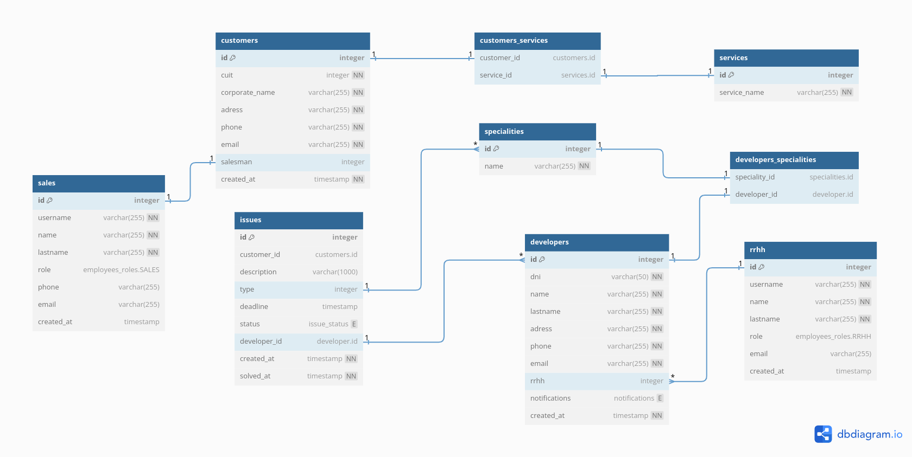
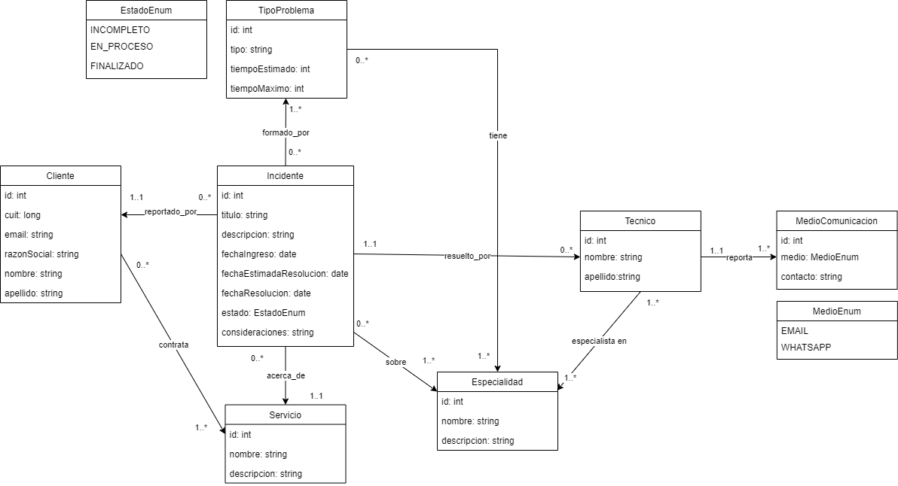
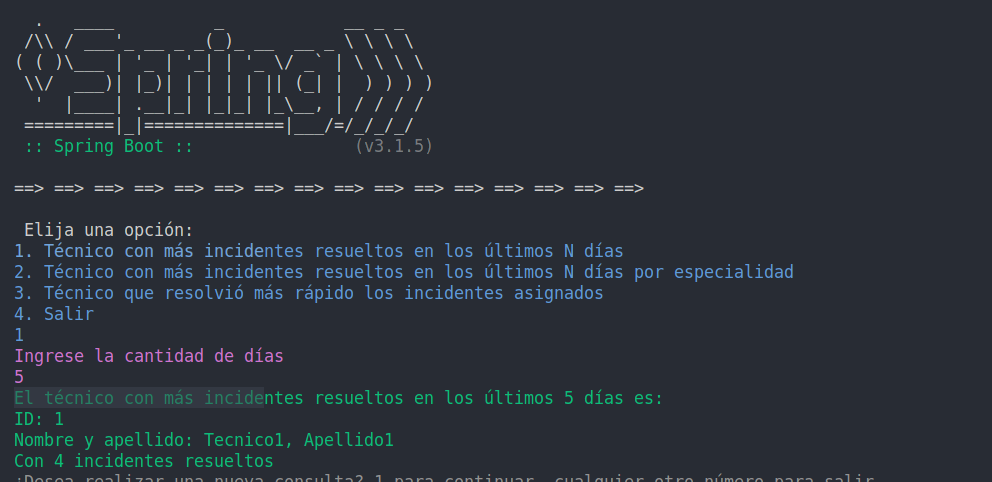

## Sistema de Reporte de Incidentes

### Descripción del Proyecto

Este repositorio contiene el código fuente para un Sistema de Reporte de Incidentes desarrollado como parte del Trabajo Práctico Integrador del Curso de Desarrollador Java Intermedio de Argentina Programa 4.0. La aplicación tiene como objetivo facilitar la generación y seguimiento de incidentes en una empresa de soporte operativo que brinda servicios sobre diversas aplicaciones y sistemas operativos.

### Entregas

#### Entrega 1

En esta iteración, nos enfocamos en el modelado a nivel de datos y objetos, así como en el inicio del proceso de codificación. A continuación, se detallan los elementos clave:

1. **Modelo de Datos (DER físico):**
   - Se ha diseñado un modelo de datos que aborda las necesidades del dominio presentado. El modelo propuesto puede encontrarse en el archivo [diagrama.png](diagrama.png).

   

2. **Código con Modelado de Clases:**
   - El código fuente, implementado en Java, ha sido organizado siguiendo buenas prácticas de diseño orientado a objetos. Se ha utilizado el proyecto Maven para la gestión de dependencias.
   - Se recomiendó la utilización de Lombok para simplificar la generación de Setters y Getters. Las dependencias necesarias están configuradas en el archivo [pom.xml](./tp_integrador/pom.xml).
   - Se implementó el modelo sugerido por los instructores [DER](DER.png)

   

#### Entrega 2

En esta iteración, nos centramos en el mapeo de clases mediante anotaciones JPA para persistir el modelo en una Base de Datos Relacional. Además, hemos desarrollado repositorios y servicios que cumplen con los requerimientos especificados:

1. **Mapeo de Clases con Anotaciones JPA:**
   - Cada entidad ha sido mapeada con anotaciones JPA para permitir su persistencia mediante el ORM Hibernate. El código correspondiente se encuentra en [paquete/entidades](./tp_integrador/src/main/java/com/argentinaprograma/issuereport/model/).

2. **Repositorios/Servicios:**
   - Se han implementado repositorios y servicios para satisfacer los siguientes requerimientos:
     - a. **Técnico con más incidentes resueltos en los últimos N días**
     - b. **Técnico con más incidentes resueltos de una determinada especialidad en los últimos N días**
     - c. **Técnico que más rápido resolvió los incidentes**

### Instrucciones de Uso

Para utilizar este proyecto, seguir los siguientes pasos:

1. **Clonar el Repositorio:**
   ```bash
   git clone https://github.com/tu-usuario/repo-incidentes.git
   ```

2. **Requisitos mínimos del Entorno de Desarrollo:**
   -  Tener instalado Java, Maven y MySQL,  además de algún IDE para Java.

3. **Importar el Proyecto:**
   - Importar el proyecto en IDE preferido (NetBeans, Eclipse,Intellij,  etc) como un proyecto Maven.

4.  **Configurar base de datos**

    Este proyecto utiliza MySQL como sistema de gestión de bases de datos. A continuación, se detallan los pasos para configurar la base de datos en el archivo `application.properties`:

2. **Crear una Base de Datos:**
   - Abrir cliente MySQL o mediante línea de comandos para crear una nueva base de datos. Por ejemplo:
     ```sql
     CREATE DATABASE issues_report;
     ```

3. **Configuración en `application.properties`:**
   - Abrir el archivo `src/main/resources/application.properties`.
   - Actualizar las siguientes propiedades con la información de tu base de datos:
     ```properties
     spring.datasource.url=jdbc:mysql://localhost:3306/issues_report
     spring.datasource.username=tu_usuario
     spring.datasource.password=tu_contraseña
     ```
    - Para ocultar los logs de spring y de las consultas realizadas a base de datos modificar las siguientes properties :
        ```properties
        logging.pattern.console= ==>  // reemplaza logs de spring por la flecha
        spring.jpa.show-sql=false // oculta logs de sql
        ```
    - Incluir este archivo en `.gitignore` para prevenir exponer datos de conexión a db.

4. **Ejecutar Aplicación:**
   - Ejecutar la aplicación desde la clase principal  `IssueReport.java` [link a clase principal](./tp_integrador/src/main/java/com/argentinaprograma/issuereport/IssueReport.java). Esta acción creará las tablas en la db , con algunos datos precargados paraejecutar consultas.

### Colaboradores

Este proyecto fue desarrollado por [Maximiliano Pisano](https://github.com/maxipisano11) y [Luciana Chamorro](https://github.com/LucianaCHA).


### Enlaces Relevantes

- [Java docs](https://docs.oracle.com/en/java/)
- [Spring ](https://springdoc.org/)
- [ Lombok](https://projectlombok.org/api/lombok/package-summary)
- [Eclipse IDE](https://www.eclipse.org/)
- [Intellij IDE](https://www.jetbrains.com/idea/)

